# Traffic Analysis using IBM Data Science Local and PixieDust
> This code pattern was also tested using [DSX Desktop](https://www.ibm.com/products/data-science-experience), a lightweight version of DSX Local intended for standalone use and optimized for local development. For production deployments it is recommended to use DSX Local with a three node configuration, for information on how to do that, see the [DSX Install Docs](https://content-dsxlocal.mybluemix.net/docs/content/local/welcome.html).

In this Code Pattern we will use PixieDust running on IBM Data Science Experience (DSX) Local to analyze traffic data from the City of San Francisco. IBM Data Science Experience (DSX) Local is a free client for data scientists and data engineers which provides tools (Juyter, Notebooks, RStudio, Spark, etc.) to analyze and gather insight from their data. 

When the reader has completed this Code Pattern, they will understand how to:

* Install [IBM Data Science Experience Local](https://content-dsxlocal.mybluemix.net/docs/content/local/overview.html)
* Use [Jupyter Notebooks](http://jupyter.org/) to load, visualize, and analyze data
* Run Notebooks in [IBM DSX Local](https://dataplatform.ibm.com/)
* Leverage [PixieDust](https://github.com/ibm-cds-labs/pixiedust) as a python notebook helper
* Build a dashboard using [PixieApps](https://ibm-watson-data-lab.github.io/pixiedust/pixieapps.html)
* Fetch data from [City of San Francisco Open Data](https://datasf.org/opendata/)
* Create an interactive map with [Mapbox GL](https://www.mapbox.com/mapbox-gl-js/api/)

The intended audience for this Code Pattern is application developers and other stakeholders who wish to utilize the power of Data Science quickly and effectively.

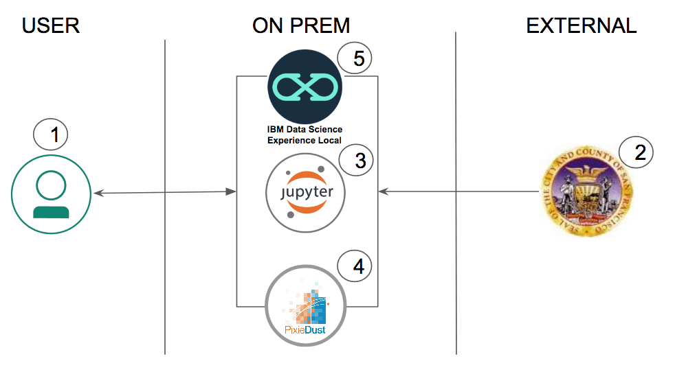

# Flow

1. Load the provided notebook into the IBM Data Science Experience (DSX) Local.
2. [DataSF Open Data](https://datasf.org/opendata/) traffic info is loaded into the Jupyter Notebook.
3. The notebook analyzes the traffic information.
4. PixieDust is imported into the notebook for fast, flexible, and easier data analysis and experimentation
5. You can interactively change charts and graphs. A PixieApp dashboard is created and can be interacted with.

# Included Components

* [IBM Data Science Experience Local](https://www.ibm.com/us-en/marketplace/data-science-experience): Analyze data using RStudio, Jupyter, and Python in a configured, collaborative environment that includes IBM value-adds, such as managed Spark.

## Featured technologies

* [Jupyter Notebooks](http://jupyter.org/): An open-source web application that allows you to create and share documents that contain live code, equations, visualizations and explanatory text.
* [PixieDust](https://github.com/ibm-cds-labs/pixiedust) Python helper library for python notebooks
* [PixieApps](https://ibm-cds-labs.github.io/pixiedust/pixieapps.html): Python library used to write UI elements for analytics, and run them directly in a Jupyter notebook.
* [Mapbox GL](https://www.mapbox.com/mapbox-gl-js/api/): JavaScript library that uses WebGL to render interactive maps.

# Pre-requisites

You need at least a 3 node cluster with DSX Local installed along with:

1. [Apache Spark](https://spark.apache.org/downloads.html)
2. [Python 2.7 and higher](https://www.python.org/downloads/) 
3. [Anaconda](https://www.anaconda.com/download/)
4. [Docker](https://docs.docker.com/install/)

# Steps

Follow these steps to setup and run this Code Pattern. The steps are
described in detail below.

1. [Login to Data Science Experience Local Cluster](#1-login-to-data-science-experience-local-cluster)
2. [Create a project](#2-create-a-project)
3. [Create the notebook](#3-create-the-notebook)
4. [Run the notebook](#4-run-the-notebook)
5. [Analyze the results](#5-analyze-the-results)
6. [Save and share](#6-save-and-share)

## 1. Login to Data Science Experience Local Cluster

Once you have the cluster ready, you can follow these [installation instructions](https://content-dsxlocal.mybluemix.net/docs/content/local/installandsetup.html) for IBM DSX Local.

## 2. Create a project

When the installation is done, the app launches and you will see sample projects and notebooks which you can start testing the app with. 

* Create a new Project by clicking the `+ new Project`.
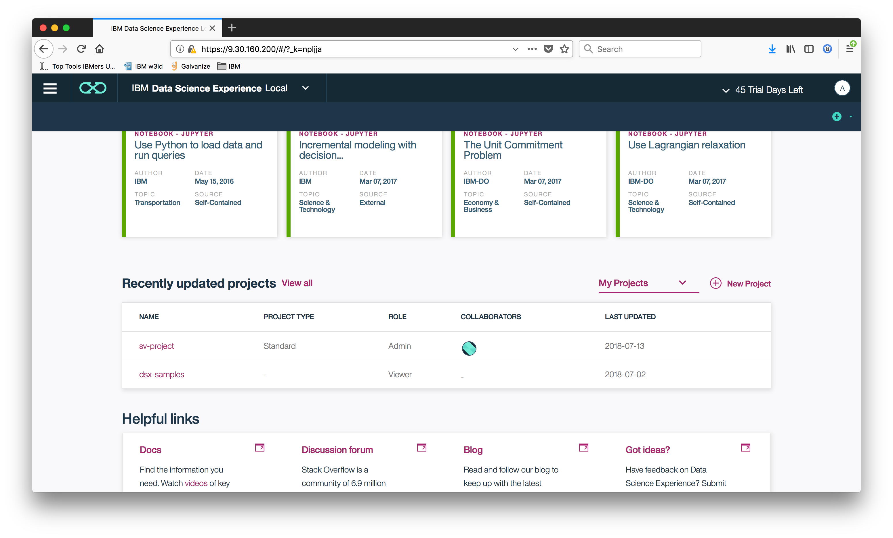

* Add project name and description, and click `Create` button to complete project creation.
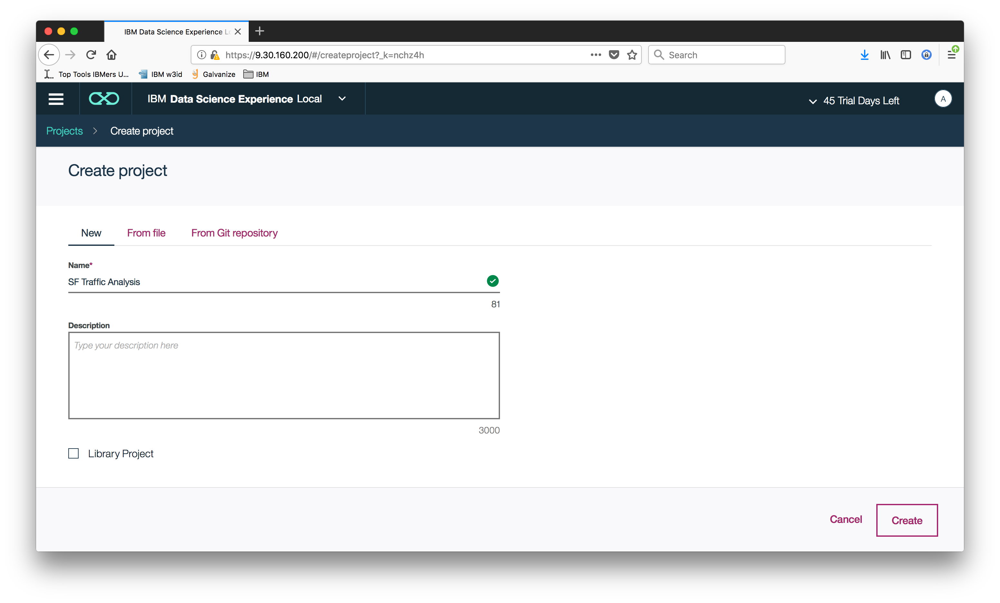 

## 3. Create the notebook

* After you create the project in IBM DSX Local, create a notebook by clicking the `+` from the top right and selecting `create notebook` option.
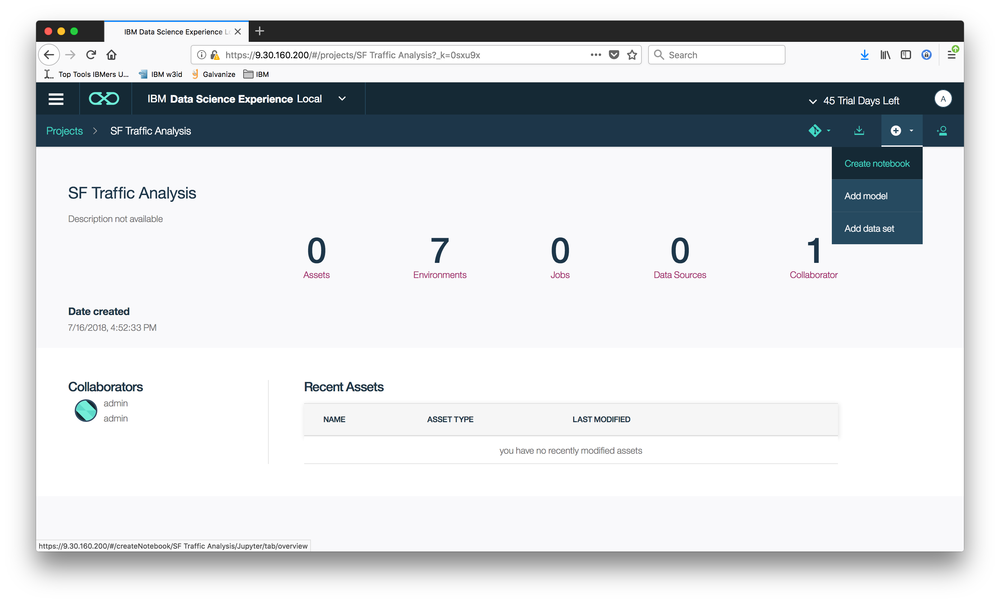
* Select the `From File` tab.
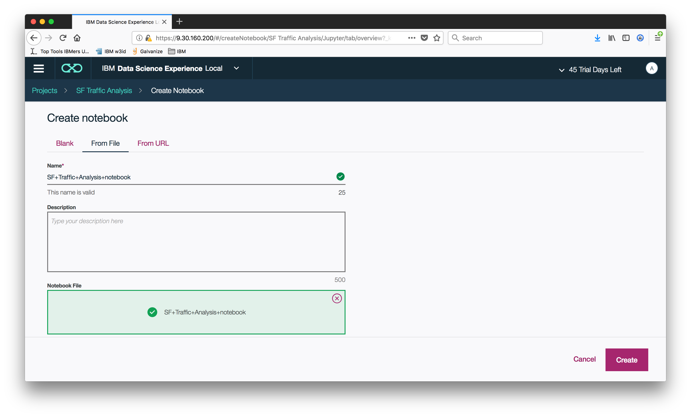
* Enter a name for the notebook.
* Optionally, enter a description for the notebook.
* Choose the following notebook part of the repostory:  [SF-Traffic-Analysis.ipynb](notebooks/SF-Traffic-Analysis.ipynb).
* Click `Create` to finish creating the notebook. 

## 4. Run the notebook

When a notebook is executed, what is actually happening is that each code cell in
the notebook is executed, in order, from top to bottom.

Each code cell is selectable and is preceded by a tag in the left margin. The tag
format is `In [x]:`. Depending on the state of the notebook, the `x` can be:

* A blank, this indicates that the cell has never been executed.
* A number, this number represents the relative order this code step was executed.
* A `*`, this indicates that the cell is currently executing.

There are several ways to execute the code cells in your notebook:

* One cell at a time.
  * Select the cell, and then press the `Run Cells` button in the toolbar.
* Batch mode, in sequential order.
  * From the `Cell` menu bar, there are several options available. For example, you
    can `Run All` cells in your notebook, or you can `Run All Below`, that will
    start executing from the first cell under the currently selected cell, and then
    continue executing all cells that follow.


## 5. Analyze the results

After running each cell of the notebook, the results will display. When we use PixieDust ``display()`` to create an interactive dataset, we are able to change the visualization using tables, graphs, and charts.

### Options for PixieDust Charts

After running cell #3 `display(incidents)`, we can see by clicking the `Options` button that we are able to manipulate the keys and values for the fields used in the chart:

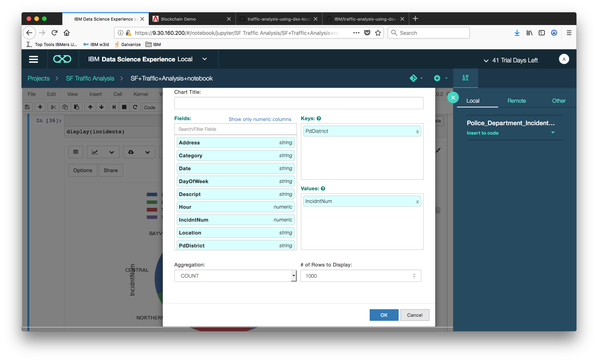

Following the instructions, we use PdDistrict and IncidntNum, but the user can change the keys and value to see how the chart will look with different inputs. Output of this chart options is shown below:

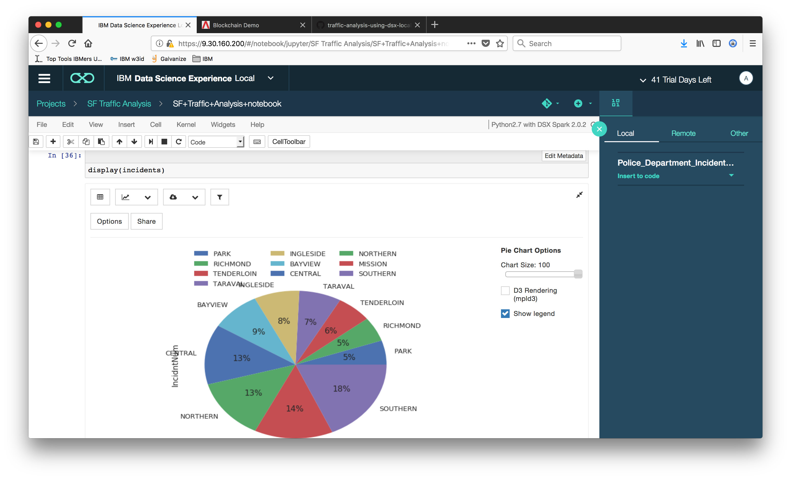

### Use Spark SQL to query data

We use Spark SQL to isolate data to the Mission district:

```
accidents.registerTempTable("incidents")
mission = sqlContext.sql("SELECT * FROM incidents WHERE PdDistrict='MISSION'")
```

We then get an interactive map of the Mission district using command `dispaly(mission)`. You can also change options as you need using the `options` button.

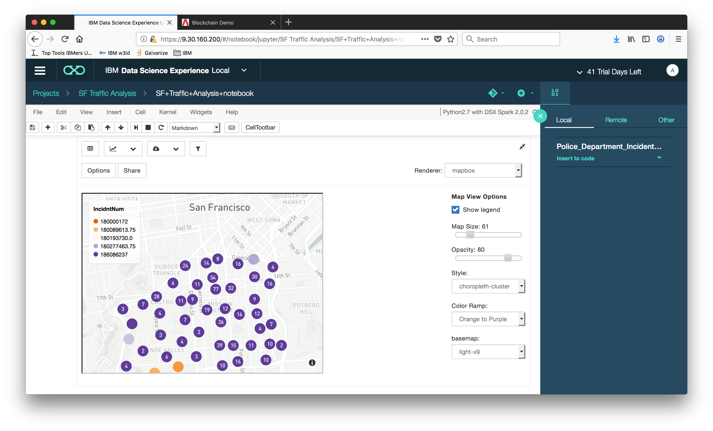

> Note: The notebook uses [Mapbox](https://www.mapbox.com) to render map of San Fransisco. In order to render the map make sure to get the `API_KEY` or `Access Token` from [Mapbox](https://www.mapbox.com). To enter the `API_KEY` or `Access Token`, click the ``options`` button.

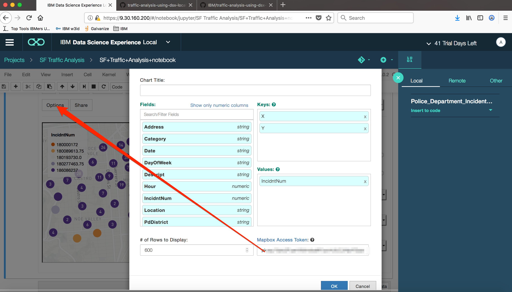


### Create a PixieApp Dashboard

With PixieApps, we can create a dashboard with map layers that can be used to visualize various datasets (i.e. Traffic Calming, Police Districts, and Crimes):

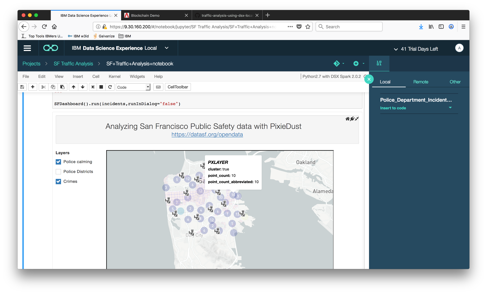

#### Create the skeleton

```
from pixiedust.display.app import *

@PixieApp
class SFDashboard():
    def mainScreen(self):
        return """
<div class="well">
    <center><span style="font-size:x-large">Analyzing San Francisco Public Safety data with PixieDust</span></center>
    <center><span style="font-size:large"><a href="https://datasf.org/opendata" target="new">https://datasf.org/opendata</a></span></center>
</div>
<div class="row">
    <div class="form-group col-sm-2" style="padding-right:10px;">
        <div><strong>Layers</strong></div>
        
        <div class="rendererOpt checkbox checkbox-primary">
            <input type="checkbox" pd_refresh="map{{prefix}}" pd_script="self.toggleLayer({{loop.index0}})">
            <label>{{layer["name"]}}</label>
        </div>
        
    </div>
    <div class="form-group col-sm-10">
        <div id="map{{prefix}}" pd_entity pd_options="{{this.formatOptions(this.mapJSONOptions)}}"/>
    </div>
</div>
"""
```

#### Create the Map of Incidents

```
<div id="map{{prefix}}" pd_entity pd_options="{{this.formatOptions(this.mapJSONOptions)}}"/>
```

``pd_entity``: Tell PixieDust which dataset to work on.

``pd_options``: Contains the PixieDust options for the map.

#### Generate the pd_options

The best way to generate the ``pd_options`` for a PixieDust visualization is to:

1. Call ``display()`` on a new cell
2.  Graphically select the options for your chart
3.  Select ``View/Cell Toobar/Edit metadata`` menu
4.  Click on the ``Edit Metadata`` button and copy the PixieDust metadata

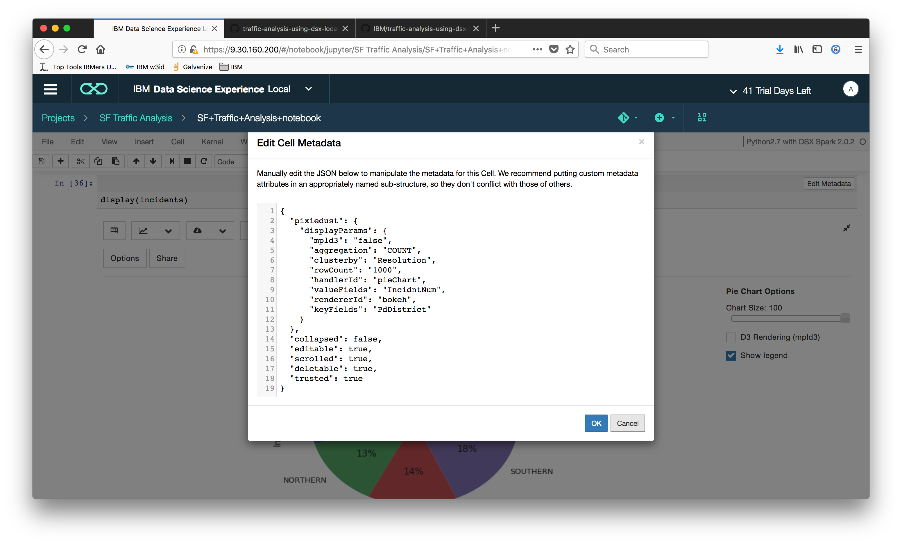

To conform to the ``pd_options`` notation, we need to transform the PixieDust JSON metadata into an attribute string with the following format: ```“key1=value1;key2=value2;…”```

To make it easier, we use a simple Python transform function:
```
def formatOptions(self, options):
    return ';'.join(["{}={}".format(k,v) for (k, v) in iteritems(options)])
```

The ``formatOptions`` is then invoked using JinJa2 notation from within the html:

```
pd_options = “{{this.formatOptions(this.mapJSONOptions)}}”
```

#### Initialize the pd_options

> Note: setup is a special method that will be called automatically when the PixieApp is initialized.

```
def setup(self):
    self.mapJSONOptions = {
      	"mapboxtoken": "<Use the map box token here>",
      	"chartsize": "90",
	"aggregation": "SUM",
	"rowCount": "500",
	"handlerId": "mapView",
	"rendererId": "mapbox",
	"valueFields": "IncidntNum",
	"keyFields": "X,Y",
	"basemap": "light-v9"
    }
```

#### Create the GeoJSON Custom Layers

```
from pixiedust.display.app import *
from pixiedust.apps.mapboxBase import MapboxBase

@PixieApp
class SFDashboard(MapboxBase):
    def setup(self):

    ...<snip>...

    self.setLayers([
        {
            "name": "Traffic calming",
            "url": "https://data.sfgov.org/api/geospatial/ddye-rism?method=export&format=GeoJSON",
            "type": "symbol",
            "layout": {
                "icon-image": "police-15",
                "icon-size": 1.5
            }
        },

    ...<snip>...
```

#### Create the Checkboxes from the Layers

```
    ...<snip>...

    
    <div class="rendererOpt checkbox checkbox-primary">
        <input type="checkbox" pd_refresh="map{{prefix}}" pd_script="self.toggleLayer({{loop.index0}})">
        <label>{{layer["name"]}}</label>
    </div>
    

    ...<snip>...
```
The user can now select layers and the map will dynamically add or remove them.


## 6. Save and Share


### How to save your work:

Under the `File` menu, there are several ways to save your notebook:

* `Save` will simply save the current state of your notebook, without any version
  information.
* `Make a copy` will make a copy of your notebook.
* `Download as` will download the notebook in different file formats such as `.ipynb`, `.py`, `.html`, `.json`,`.md`,`.rst`

### How to share your work:

You can publish your notebook by selecting the cloud icon button located in the top menu bar. You need anaconda cloud username and password to share your notebook to `anaconda.org`.

# Sample Output

There is a sample of the output in [doc/source/example-output.html](doc/source/example-output.html)

# Troubleshooting

## Troubleshooting for DSX local

* If the cluster doesn't have any open connection you might need to upload the data set into the cluster using `Add Dataset` from the projects page. And you can use `Find Data` to upload the data and `import spark dataframe in python` which will create the code for you and add it to the selected cell in the notebook.

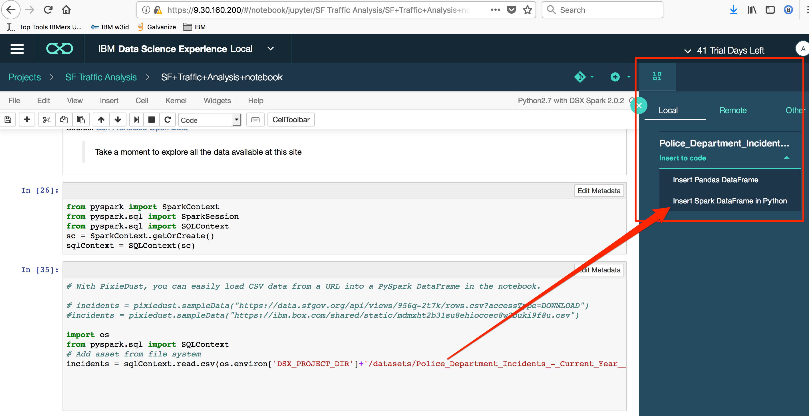

## Troubleshooting for DSX desktop

* You can see all the processes in docker by running the command in terminal: `docker ps`
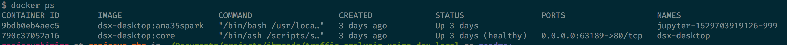
* In order to view logs on your notebook you can select the container id of the notebook and run : `docker logs <container id>`
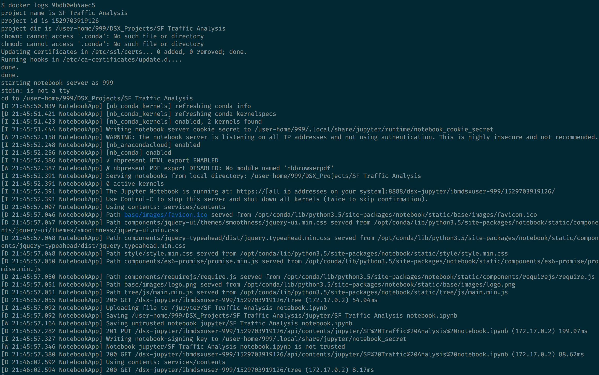
* You might have to upgrade `tornado` by running `pip install --upgrade tornado`
* If after uploading the notebook, the DSX Desktop shows you loading icon for long do the following steps:
 * Close IBM DSX desktop
 * Kill all the processes related to DSX Local from terminal: `docker ps |grep dsx` and `docker rm -f <container id>`
 * `cd ~/Library/Application \Support/` and `rm -rf ibm-dsx-desktop`
 * restart DSX Desktop
 * load the jupyter notebook again
* You can view all the docker images used by the app using: `docker images`
* All the logs can be found in location: `~/Library/Application \Support/Logs/`


# Links

* [PixieDust](https://github.com/ibm-cds-labs/pixiedust)
* [PixieApps](https://ibm-watson-data-lab.github.io/pixiedust/pixieapps.html)
* [City of San Francisco Open Data](https://datasf.org/opendata/)

# Learn more

* **Artificial Intelligence Code Patterns**: Enjoyed this Code Pattern? Check out our other [AI Code Patterns](https://developer.ibm.com/code/technologies/artificial-intelligence/).
* **Data Analytics Code Patterns**: Enjoyed this Code Pattern? Check out our other [Data Analytics Code Patterns](https://developer.ibm.com/code/technologies/data-science/)
* **AI and Data Code Pattern Playlist**: Bookmark our [playlist](https://www.youtube.com/playlist?list=PLzUbsvIyrNfknNewObx5N7uGZ5FKH0Fde) with all of our Code Pattern videos
* **With Watson**: Want to take your Watson app to the next level? Looking to utilize Watson Brand assets? [Join the With Watson program](https://www.ibm.com/watson/with-watson/) to leverage exclusive brand, marketing, and tech resources to amplify and accelerate your Watson embedded commercial solution.
* **Watson Studio**: Master the art of data science with IBM's [Watson Studio](https://dataplatform.ibm.com/)

# License

[Apache 2.0](LICENSE)


